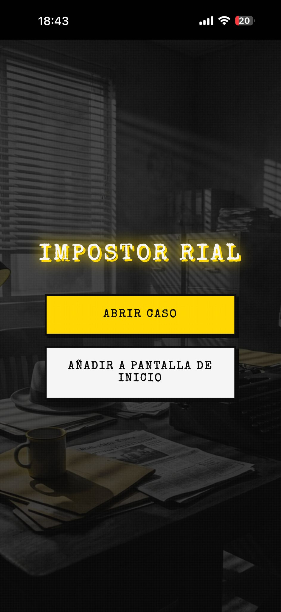
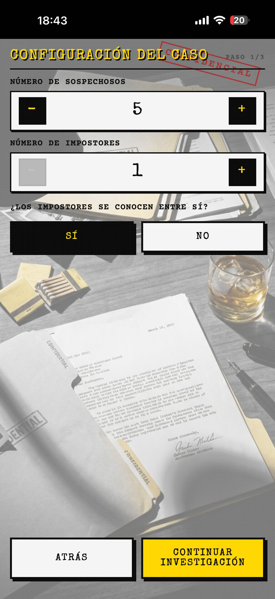
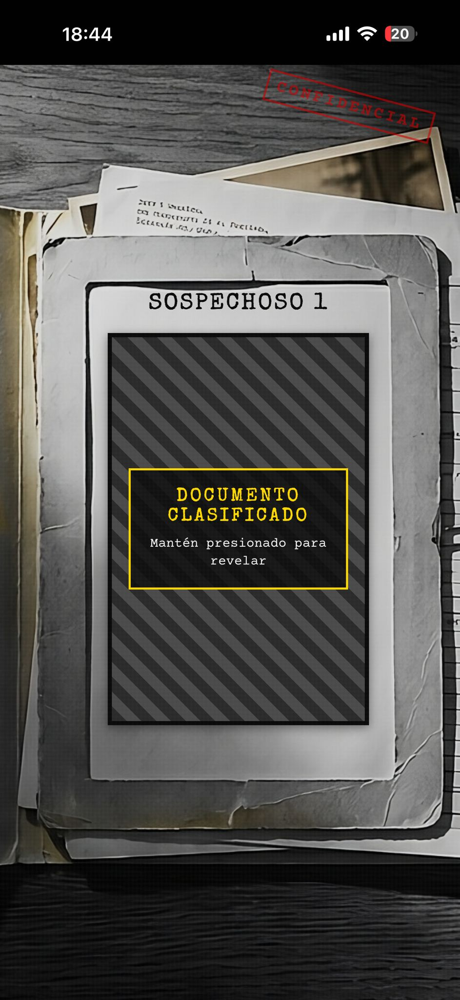
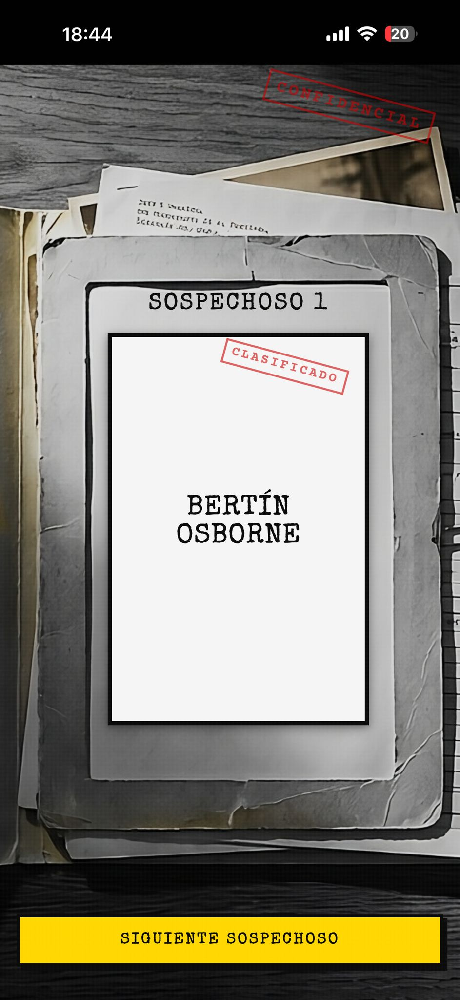
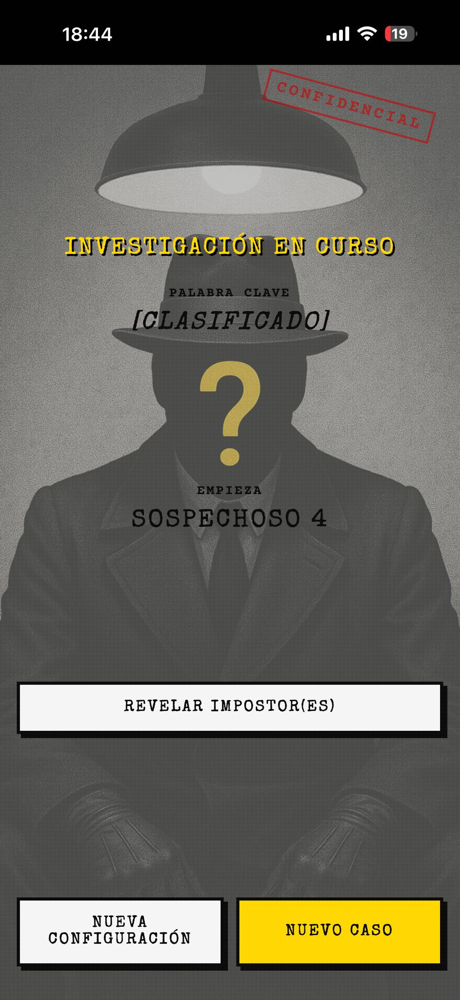
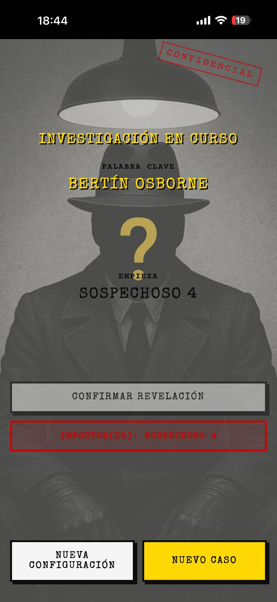

# Rial Impostor

¡Bienvenido a **Rial Impostor**! Un juego de deducción social con un toque de misterio y estética *Film Noir*, diseñado para jugar en grupo pasando el móvil.



## 🕵️ ¿De qué va el juego?

Similar a juegos como *"Spyfall"* o *"El Impostor"*, en cada ronda todos los jugadores reciben una **Palabra Secreta**, excepto uno (o más) **Impostores**.

*   🎯 **Objetivo de los Agentes**: Descubrir quién es el impostor diciendo palabras relacionadas con la palabra clave.
*   🎭 **Objetivo del Impostor**: Pasar desapercibido, fingir que sabe la palabra y, si es posible, adivinarla.

### Condiciones de Victoria
*   **Agentes**: Ganan al descubrir y votar correctamente al impostor.
*   **Impostores**: Ganan si adivinan la palabra clave o si logran confundir a los agentes hasta que queden el mismo número de agentes que de impostores.

---

## 🎮 Tutorial: Cómo Jugar

### 1. Configuración del Caso
Al pulsar "Jugar", accederás al panel de configuración. Aquí el "Jefe de Policía" (cualquiera de vosotros) configura la partida:



*   **Sospechosos**: Número total de jugadores (3-20).
*   **Impostores**: Cuántos enemigos infiltrados habrá.
*   **¿Se Conocen?**: Si activas esto, los impostores sabrán quiénes son sus compañeros.
*   **Categorías**: Selecciona los temas (Animales, Famosos, Objetos...).
*   **Nombres**: Escribe los nombres de los jugadores para personalizar la experiencia.

### 2. Clasificado: Top Secret
El juego te dará una carta de "Caso Clasificado". Pásale el móvil al jugador cuyo nombre aparece en pantalla.



El jugador debe **mantener pulsada** la carta para ver su identidad en secreto.

*   Si eres **Agente**, verás la palabra clave (ej. "Detectives").
*   Si eres **Impostor**, verás un mensaje en rojo diciendo "Impostor".



Al soltar, la carpeta se cierra. Pulsa "Siguiente Sospechoso" y pasa el móvil al siguiente jugador.

### 3. La Investigación
Cuando todos saben su rol, aparece el **Tablero de Investigación**.



*   **Palabra Clave**: Aparece como `[CLASIFICADO]` para evitar miradas indiscretas.
*   **Empieza**: El juego elige al azar quién debe lanzar la primera pregunta o afirmación.

**Dinámica:**
Hablad por turnos. Decid una palabra relacionada con la clave, pero no tan obvia como para que el impostor la adivine, ni tan críptica como para parecer sospechoso.

### 4. El Veredicto
Cuando creáis saber quién es el impostor, tras un tiempo límite que acordéis o tras terminar la ronda, pulsad el botón **"Revelar Impostor(es)"**. Esto también revela la palabra clave.



El juego desclasificará el archivo mostrando la palabra real y los nombres de los culpables.

---

## 🚀 Instalación y Uso

Este proyecto es una aplicación web estática (Vanilla JS/HTML/CSS), por lo que no requiere compilación.

### Opción 1: Jugar Online
(Aquí puedes poner el enlace a GitHub Pages si lo activas)

### Opción 2: Ejecutar Localmente
1.  Clona este repositorio:
    ```bash
    git clone https://github.com/usuario/RialImpostor.git
    ```
2.  Abre el archivo `index.html` en tu navegador.

### Opción 3: Instalar como App (PWA)

**Tutorial de Instalación en iOS:**

1.  **Paso 1:** Pulsa el botón de compartir del navegador.
    

2.  **Paso 2:** Busca y pulsa la opción "+ Añadir a inicio".
    

3.  **Paso 3:** Pulsa "Añadir" para confirmar.
    

¡Ahora tendrás el icono de la app en tu escritorio y funcionará a pantalla completa!

---

## ✨ Características

*   **Estilo Noir**: Atmósfera inmersiva con efectos de sonido (tecleo, carpetas).
*   **PWA**: Optimizada para instalación nativa en móviles.
*   **Datos Reales**: Cientos de palabras en diversas categorías.
*   **Fair Play**: Algoritmo de selección de palabras equitativo.

> **Nota sobre el contenido**: La categoría "Coñas" contiene referencias y chistes internos del grupo de desarrollo original. Se recomienda desactivarla para partidas con nuevos jugadores o público general para evitar confusión.

---

*Creado para la diversión y el misterio.*
"# RialImpostor" 
