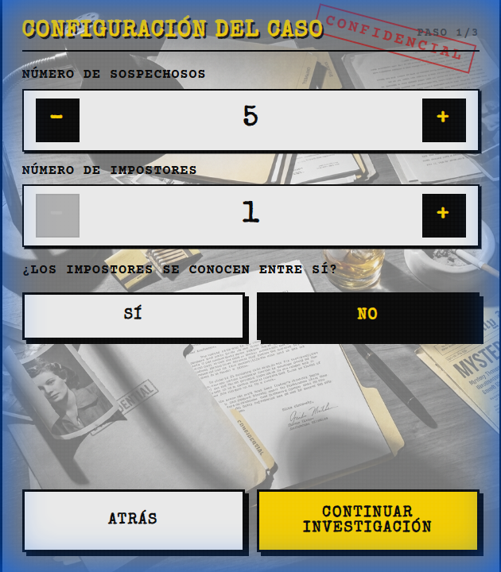
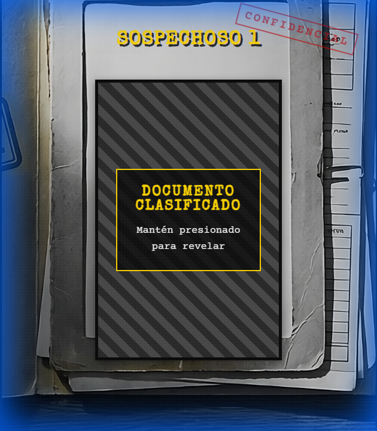
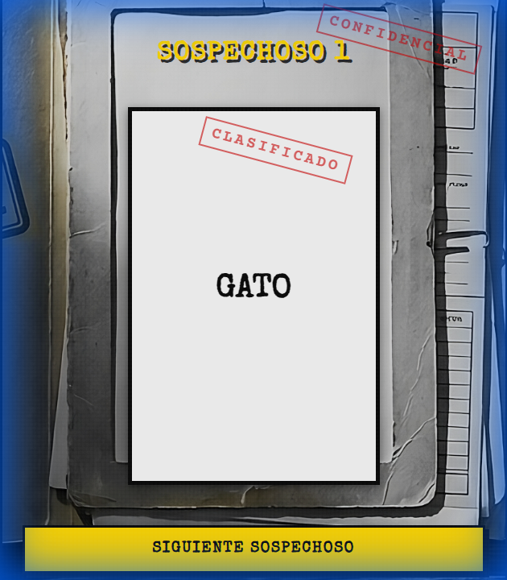
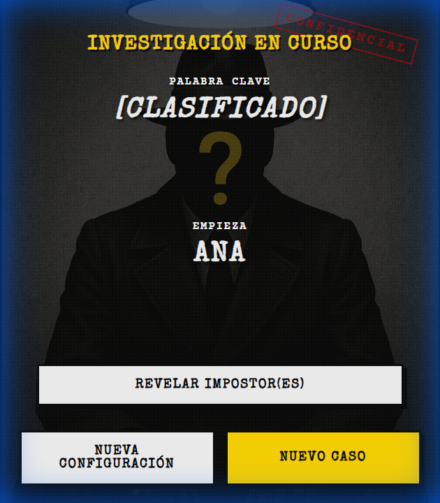
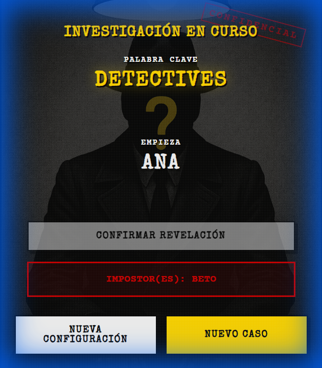

# Rial Impostor

¡Bienvenido a **Rial Impostor**! Un juego de deducción social con un toque de misterio y estética *Film Noir*, diseñado para jugar en grupo pasando el móvil.

## 🕵️ ¿De qué va el juego?

Similar a juegos como *"Spyfall"* o *"El Impostor"*, en cada ronda todos los jugadores reciben una **Palabra Secreta**, excepto uno (o más) **Impostores**.

*   🎯 **Objetivo de los Agentes**: Descubrir quién es el impostor diciendo palabras relacionadas con la palabra clave.
*   🎭 **Objetivo del Impostor**: Pasar desapercibido, fingir que sabe la palabra y, si es posible, adivinarla.

* **Como ganan los agentes**: Al descubrir quién es el impostor.
* **Como ganan los impostores**: Al adivinar la palabra clave o quedar el mismo numero de agentes que de impostores.
---

## 🎮 Tutorial: Cómo Jugar

### 1. Configuración del Caso
Al pulsar "Jugar", accederás al panel de configuración. Aquí el "Jefe de Policía" (cualquiera de vosotros) configura la partida:

*   **Sospechosos**: Número total de jugadores (3-20).
*   **Impostores**: Cuántos enemigos infiltrados habrá.
*   **¿Se Conocen?**: Si activas esto, los impostores sabrán quiénes son sus compañeros.
*   **Categorías**: Selecciona los temas (Animales, Famosos, Objetos...).
*   **Nombres**: Escribe los nombres de los jugadores para personalizar la experiencia.

### 2. Clasificado: Top Secret
El juego te dará una carta de "Caso Clasificado". Pásale el móvil al jugador cuyo nombre aparece en pantalla.

El jugador debe **mantener pulsada** la carta para ver su identidad en secreto.

*   Si eres **Agente**, verás la palabra clave (ej. "Detectives").
*   Si eres **Impostor**, verás un mensaje en rojo diciendo "Impostor".

Al soltar, la carpeta se cierra. Pulsa "Siguiente Sospechoso" y pasa el móvil al siguiente jugador.

### 3. La Investigación
Cuando todos saben su rol, aparece el **Tablero de Investigación**.

*   **Palabra Clave**: Aparece como `[CLASIFICADO]` para evitar miradas indiscretas.
*   **Empieza**: El juego elige al azar quién debe lanzar la primera pregunta o afirmación.

**Dinámica:**
Hablad por turnos. Decid una palabra relacionada con la clave, pero no tan obvia como para que el impostor la adivine, ni tan críptica como para parecer sospechoso.

### 4. El Veredicto
Cuando creáis saber quién es el impostor, tras un tiempo límite que acordéis o tras terminar la ronda, pulsad el botón **"Revelar Impostor(es)"** esto también revela la palabra clave en caso de que el impostor la adivine.

El juego desclasificará el archivo mostrando la palabra real y los nombres de los culpables.

---

## ✨ Características

*   **Estilo Noir**: Atmósfera inmersiva con efectos de sonido (tecleo, carpetas).
*   **PWA**: Instálalo como App Nativa en tu móvil desde el navegador ("Añadir a pantalla de inicio").
*   **Datos Reales**: Miles de palabras en categorías como Famosos Españoles, Coñas, Comida, etc.
*   **Lógica Justa**: Sistema de selección de probabilidad equitativa para las categorías.
*   **la categoría de coñas es una categoría de coñas privadas por lo tanto no es recomendable usarla en un juego público donde no se encuentren amigos mios que entiendan dichas coñas**
---

*Creado para la diversión y el misterio.*
"# RialImpostor" 
